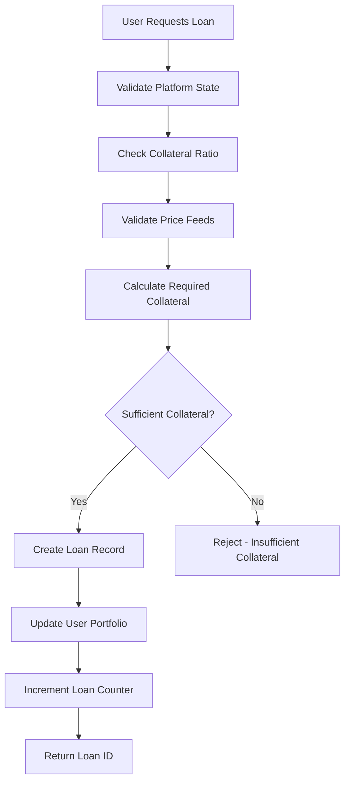
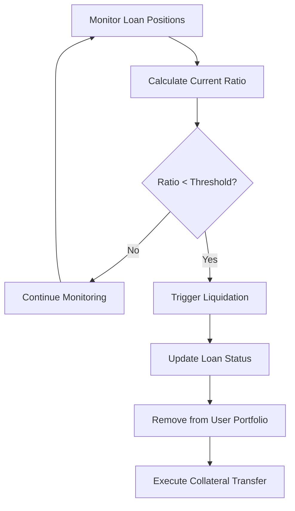

# LiquidStack Protocol

## Overview

LiquidStack is a next-generation decentralized finance (DeFi) protocol built on the Stacks blockchain that transforms dormant crypto assets into active capital through intelligent collateralization. The protocol enables users to leverage their cryptocurrency holdings as collateral for immediate liquidity without sacrificing long-term investment positions.

## Key Features

- **Intelligent Collateral Management**: Real-time risk assessment with automated liquidation protection
- **Multi-tier Liquidation Protection**: Sophisticated mechanisms to protect user positions
- **Adaptive Interest Rate Optimization**: Dynamic rates based on market conditions
- **Cross-protocol Compatibility**: Maximum flexibility for DeFi integration
- **Transparent Governance**: Community-driven parameter adjustments
- **Institutional-grade Security**: Enterprise-level security with DeFi accessibility

## System Architecture

### Core Components

```
┌─────────────────────────────────────────────────────────────┐
│                    LiquidStack Protocol                     │
├─────────────────────────────────────────────────────────────┤
│  ┌─────────────────┐  ┌─────────────────┐  ┌─────────────────┐ │
│  │  Loan Engine    │  │ Collateral Mgmt │  │ Risk Assessment │ │
│  │                 │  │                 │  │                 │ │
│  │ • Origination   │  │ • Deposit       │  │ • Liquidation   │ │
│  │ • Repayment     │  │ • Withdrawal    │  │ • Ratio Calc    │ │
│  │ • Interest Calc │  │ • Tracking      │  │ • Price Feeds   │ │
│  └─────────────────┘  └─────────────────┘  └─────────────────┘ │
├─────────────────────────────────────────────────────────────┤
│  ┌─────────────────┐  ┌─────────────────┐  ┌─────────────────┐ │
│  │   Governance    │  │   Data Layer    │  │   Oracle Feed   │ │
│  │                 │  │                 │  │                 │ │
│  │ • Parameters    │  │ • Loan Records  │  │ • Price Updates │ │
│  │ • Thresholds    │  │ • User Mapping  │  │ • Asset Prices  │ │
│  │ • Fee Rates     │  │ • Statistics    │  │ • Validation    │ │
│  └─────────────────┘  └─────────────────┘  └─────────────────┘ │
└─────────────────────────────────────────────────────────────┘
```

### Contract Architecture

The LiquidStack protocol is structured around several key modules:

#### 1. **Core State Management**

- Platform initialization and configuration
- Collateral ratio management (150% minimum)
- Liquidation threshold controls (120% trigger)
- Protocol fee structure (1% platform fee)

#### 2. **Loan Management System**

- Comprehensive loan tracking with unique IDs
- Multi-attribute loan records (borrower, amounts, rates, status)
- Interest calculation engine with compound interest
- Automated repayment processing

#### 3. **Risk Management Framework**

- Real-time collateralization ratio monitoring
- Automated liquidation triggers
- Price feed validation and sanity checks
- Asset whitelist management

#### 4. **User Interface Layer**

- Portfolio tracking and management
- Loan origination and repayment
- Collateral deposit and withdrawal
- Analytics and reporting

## Data Flow

### Loan Origination Process



### Liquidation Process



## Technical Specifications

### Supported Assets

- **BTC**: Bitcoin collateral
- **STX**: Stacks tokens
- Extensible architecture for additional assets

### Key Parameters

- **Minimum Collateral Ratio**: 150% (configurable)
- **Liquidation Threshold**: 120% (configurable)
- **Platform Fee**: 1% (configurable)
- **Interest Rate**: 5% annual (per loan basis)
- **Maximum Loans per User**: 10 active loans

### Error Handling

The protocol implements comprehensive error handling with specific error codes:

- Authorization errors (100)
- Collateral and amount validation (101-103)
- Platform state management (104-105)
- Loan lifecycle management (106-109)
- Price and asset validation (110-111)

## Smart Contract Interface

### Core Functions

#### Administrative Functions

```clarity
(initialize-platform) → ok bool
(update-collateral-ratio uint) → ok bool
(update-liquidation-threshold uint) → ok bool
(update-price-feed string-ascii uint) → ok bool
```

#### User Functions

```clarity
(deposit-collateral uint) → ok bool
(request-loan uint uint) → ok uint
(repay-loan uint uint) → ok bool
```

#### Query Functions

```clarity
(get-loan-details uint) → optional loan-data
(get-user-loans principal) → optional user-loans
(get-platform-stats) → platform-statistics
(get-valid-assets) → list string-ascii
```

## Security Features

### Access Control

- Owner-only administrative functions
- Loan-specific borrower authorization
- Platform initialization protection

### Risk Mitigation

- Collateral ratio validation
- Price feed sanity checking
- Asset whitelist enforcement
- Liquidation protection mechanisms

### Data Integrity

- Immutable loan records
- Atomic transaction processing
- Comprehensive error handling
- State validation checks

## Installation & Deployment

### Prerequisites

- Stacks blockchain node
- Clarity development environment
- Sufficient STX for deployment

### Deployment Steps

1. Deploy the LiquidStack contract to Stacks blockchain
2. Initialize the platform using `initialize-platform`
3. Configure initial price feeds for supported assets
4. Set appropriate collateral ratios and liquidation thresholds

### Testing

The contract includes comprehensive validation and error handling suitable for:

- Unit testing of individual functions
- Integration testing of loan workflows
- Stress testing of liquidation scenarios
- Price feed manipulation testing

## Usage Examples

### Basic Loan Workflow

```clarity
;; 1. Initialize platform (owner only)
(contract-call? .liquidstack initialize-platform)

;; 2. Update BTC price feed
(contract-call? .liquidstack update-price-feed "BTC" u5000000) ;; $50,000

;; 3. User deposits collateral
(contract-call? .liquidstack deposit-collateral u100) ;; 1 BTC

;; 4. Request loan
(contract-call? .liquidstack request-loan u100 u3000000) ;; $30,000 loan

;; 5. Repay loan with interest
(contract-call? .liquidstack repay-loan u1 u3150000) ;; Loan + interest
```

## Governance & Upgrades

The protocol includes governance mechanisms for:

- Adjusting collateral requirements
- Modifying liquidation thresholds
- Updating supported assets
- Managing protocol fees

## Contributing

LiquidStack is designed for the modern DeFi ecosystem with institutional-grade security while maintaining accessibility and innovation. The protocol welcomes community contributions and governance participation.

## License

This smart contract is provided for educational and development purposes. Please ensure compliance with applicable regulations before deployment in production environments.

---

**Built on Stacks** | **Powered by Clarity** | **Secured by Bitcoin**
